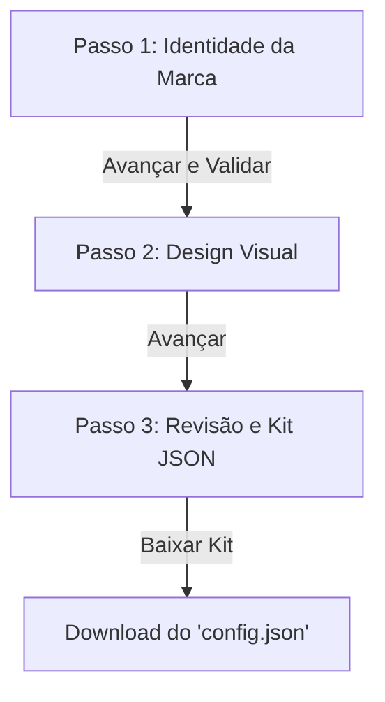

# 🏷️ EPMA Commander - Kit de Customização White-Label (WL)

Este diretório contém os arquivos de configuração, temas e orientações para rebrandear e revender o **EPMA Commander** sob a sua própria identidade visual, cores e logotipo (White-Label).

---

## 🚀 Arquitetura de Subdomínios Dinâmicos (SaaS Multitenant)

No futuro, a plataforma operará de forma totalmente multitenant baseada em subdomínios dinâmicos sob a zona `epma.cloud`:
*   **Domínio Principal:** `cmd.epma.cloud` (Carrega a marca padrão do EPMA Commander)
*   **Subdomínio White-Label:** `[empresa]-cmd.epma.cloud` (Ex: `empresaxyz-cmd.epma.cloud` mapeia no Express para carregar as configurações personalizadas do cliente sem conflitos)

Para suportar essa arquitetura, o middleware no Express interpretará o cabeçalho `host` de forma automática:
```javascript
app.use((req, res, next) => {
    const host = req.headers.host; // Ex: empresaxyz-cmd.epma.cloud
    if (host && host.endsWith('-cmd.epma.cloud')) {
        const tenant = host.split('-cmd')[0]; // Ex: empresaxyz
        req.tenant = tenant;
    }
    next();
});
```

---

## 🖥️ Painel Super-Admin Global (Gerenciamento de Tenants)

Para gerenciar de forma profissional sua rede de parceiros White-Label, conceituamos um **Painel de Controle Super-Admin** centralizado em `/admin` no domínio principal:

```
+----------------------------------------------------------------------------+
|  📊 Painel Super-Admin  |  [cmd.epma.cloud/admin]                          |
+----------------------------------------------------------------------------+
|  Tenants Ativos (SaaS)     | Status   | Domínio                             |
|  1. Empresa XYZ            | Ativo    | empresaxyz-cmd.epma.cloud           |
|  2. LLM Corp               | Ativo    | llmcorp-cmd.epma.cloud              |
|  3. Client ABC             | Aguard.  | clientabc-cmd.epma.cloud            |
+----------------------------------------------------------------------------+
|  [+] Criar Novo Tenant     | [*] Gerenciar Configurações | [x] Suspender   |
+----------------------------------------------------------------------------+
```

### 📋 Fluxo de Funcionamento Dinâmico:
1. **Provisionamento Centralizado:** O Super-Admin insere o nome ou domínio do parceiro (ex: `empresaxyz`) e define as chaves padrão no próprio painel admin.
2. **Isolamento de Banco de Dados:** Você pode configurar o Express para carregar e instanciar conexões SQLite dinâmicas com base no tenant (ex: `db_empresaxyz.db`) ou manter chaves de isolamento de dados baseadas em tabelas relacionais compartilhadas.
3. **Gerenciamento Unificado:** Permite ativar/desativar domínios WL, alterar cotas de tokens da API Novita dos clientes e analisar métricas de custos em um dashboard central exclusivo para você.

---

## 📂 Estrutura do Kit WL

1. **[config.json](config.json)**: Arquivo central de marca. Customize o nome da empresa, slogans, domínios, logotipos, tokens e chaves padrão.
2. **[theme.css](theme.css)**: Variáveis CSS e regras de estilo prontas para alterar toda a identidade de cores da aplicação (Tailwind & CSS puro).
3. **[index.html](index.html)**: O **Configurador White-Label Wizard** interativo para customização visual e de marca passo a passo em 3 etapas simples.

---

## 🗺️ Passos do Wizard

O wizard orienta o administrador da marca sobre o design visual e os dados corporativos em **3 etapas encadeadas**:



### 1. 🆔 Passo 1: Informações da Marca
*   **Nome do Produto**: Substitui o termo global do sistema com o seu nome personalizado de escolha.
*   **Nome da Empresa**: Define a propriedade dos direitos autorais.
*   **Slogan / Tagline**: Atualiza o texto dinâmico na tela de login e de boas-vindas do app.
*   **Suporte**: Define o e-mail de contato oficial do cliente.

### 2. 🎨 Passo 2: Estilo Visual do Painel
*   **Seletores de Cores**: Sincronização bidirecional em tempo real entre os color pickers nativos e de texto para a Cor Primária e Secundária.
*   **Arredondamento (`border-radius`)**: Opções de cantos vivos ou ultra-arredondados seguindo a estética premium do EPMA.
*   **Tema do Fundo**: Escolha do tema de renderização (Escuro Moderno ou Claro).

### 3. 💾 Passo 3: Revisão e Exportação
*   **Live Preview**: Bloco de código formatado e colorido dinamicamente com o novo objeto JSON gerado ao alterar as opções.
*   **Download Automático**: Criação e empacotamento nativo do arquivo `config.json` pronto para ser colocado em produção e redistribuído com as suas credenciais.

---

## 🎨 Como Aplicar a sua Marca

1. Abra o arquivo `WL/index.html` no seu navegador ou acesse `/WL/` caso o servidor local esteja rodando.
2. Preencha todos os passos informativos e visuais utilizando o Wizard interativo.
3. Clique em **Download / Gerar e Salvar Kit** ao final do fluxo para obter o novo arquivo `config.json` compilado na hora.
4. Substitua o arquivo `WL/config.json` pelo arquivo que você baixou para consolidar as alterações de marca.
